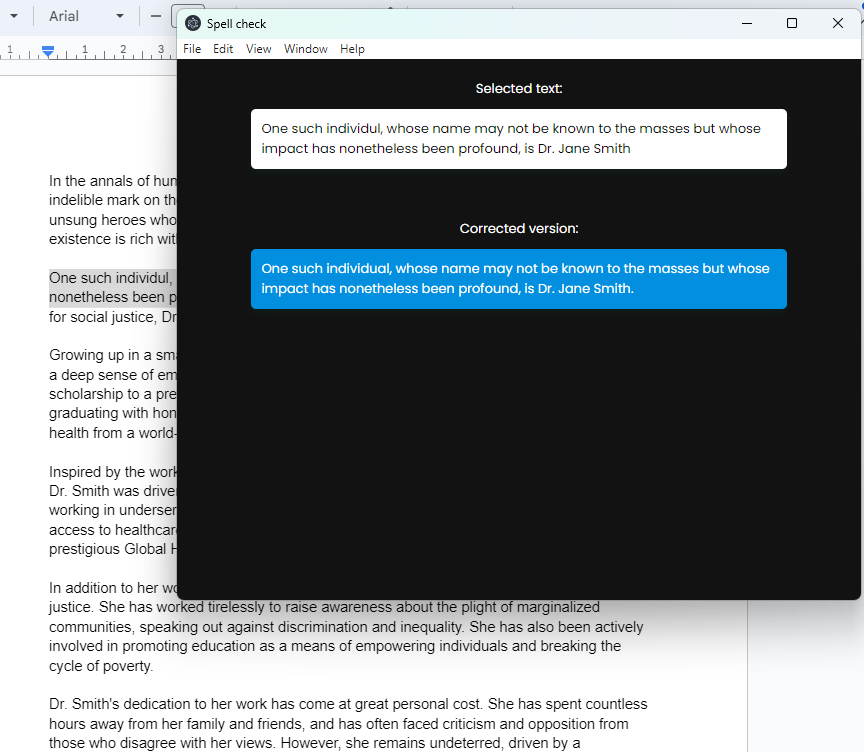

# Windows ChatGPT Spell Checker

This project is a Windows desktop application that leverages ChatGPT to correct spelling and grammar directly from the clipboard. It's built using Electron, making it lightweight and easy to use. The application activates with a simple shortcut, instantly correcting text from the clipboard using ChatGPT's powerful AI capabilities.

> **Note:** Let's be honest, this app is basically made with AI witthout doing any real work. But hey, that's the beauty of it! You get all the benefits of having your own personal editor without any of the effort. Even this README.md is crafted with the help of AI, just like the rest of the program.

**To ensure the application works correctly with your own OpenAI account, please change the API key inside `modules/openai.js`.**

## Features

- **Clipboard Monitoring**: Automatically reads text from the clipboard when activated. (Yes, we're basically mind readers.)
- **Instant Correction**: Uses ChatGPT to correct spelling and grammar errors in the text. (We let the AI do the heavy lifting, so we don't have to.)
- **Shortcut Activation**: Easily toggle the application window with the `Shift+Alt+J` shortcut. (Because who has time for clicking around?)
- **Tray Icon**: Access the application from the system tray for quick actions like showing the window or quitting the app. (It's like having a little genie in your tray.)
- **Non-Intrusive**: Runs quietly in the background, ready to assist when needed without disrupting your workflow. (It's like it's not even there... spooky, right?)

## User Commands - The Magic Spells

To make your life even easier, here's what you need to do:

1. **Copy Text**: Just copy the text you want corrected. (Ctrl+C, old school style.)
2. **Activate Magic**: Hit the `Shift+Alt+J` shortcut. This is where the magic happens.
3. **Paste Corrected Text**: Paste the text back where you need it. (Ctrl+V, and voilà!)

Remember, it's as easy as 1-2-3. Copy, click shortcut, then paste. No wands or magic words required, just your trusty shortcut.

